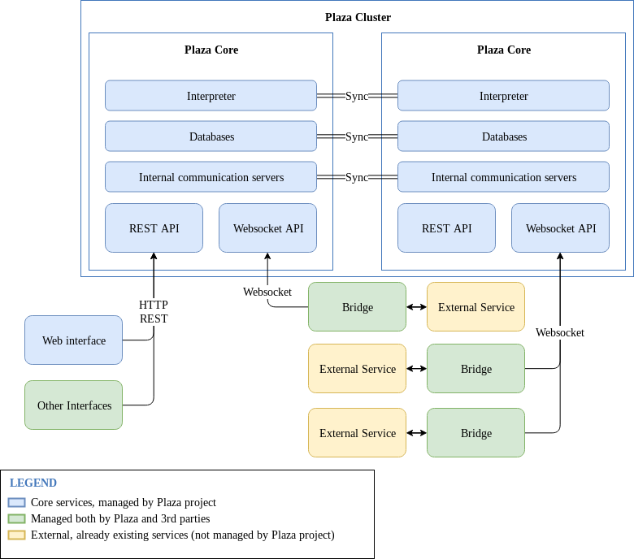

# What is Plaza?

Plaza is a project to build an easily programmable, distributed computer that can run your programs on a fault-resistant manner.

Plaza programs are not run on your computer. Thus, it is especially suited for simple tasks that don't require a lot of computing power but that must run contiguously, for example:
* Chat bots
* Connections between services
* Scheduled tasks

Plaza is programmed using MIT's Scratch language. Through it, and Plaza's distributed computer, the steps to create a new program are:
* Open a new program in your web browser
* Configure the program steps
* Press run

[(We are looking for other environments to learn from, tell us about your favourite visual automation tools!)](mailto:plaza@spiral.systems)

## Setup

### For development

It's posible to rapidly create a private deployment of plaza to test developments using docker-compose. To do this, just run `docker-compose up` on the root directory (the one with this README.md file).

## Architecture overview

